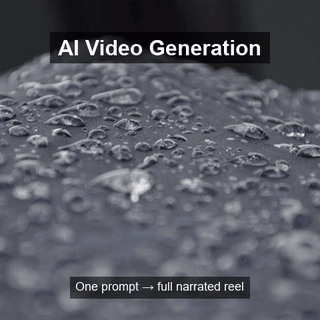

# AI Video Generation

> One prompt → full video with voice. Fully local. No SaaS APIs.

A Python pipeline that turns a single text prompt into a complete marketing reel, educational video, or social media short — narrated, captioned, and rendered into MP4 — all on your local machine.

The system uses **Claude Code** (or any agent) as the orchestration brain, **ComfyUI** with Stable Diffusion 1.5 for image generation, **FFmpeg** for motion + assembly, and **pyttsx3** (Windows SAPI) for text-to-speech.

---

## Keywords

`ai-video-generation` · `comfyui` · `stable-diffusion` · `ffmpeg` · `text-to-video` · `local-ai` · `python` · `tts` · `pyttsx3` · `marketing-reel` · `automated-video` · `cpu-inference` · `claude-code` · `video-pipeline` · `kinetic-typography`

---

## just a image to animation, like google flow



A short preview of the kind of output the pipeline produces — Ken Burns motion, lower-third caption, voiceover (in the full MP4). Run `python main.py "Your prompt" --duration 5` to generate your own.

---

## Features

- **One-prompt input** — type a description, get a full video
- **Configurable duration** — `--duration 5` for a 5-minute reel, `--duration 1` for a TikTok short
- **Three video modes** — marketing, educational, social (auto-detected from prompt)
- **Adaptive motion** — Ken Burns zoom/pan calibrated to scene length
- **Burned-in captions** — voiceover text shown as lower-third subtitles
- **Voice narration** — Windows SAPI TTS, no internet required
- **Fade transitions** — smooth in/out between scenes
- **Fully local** — no SaaS, no API keys, no data leaves your machine

---

## Architecture

```
        ┌─────────────────┐
Prompt ─►│   main.py       │  orchestrator
        └────────┬────────┘
                 │
        ┌────────▼────────┐
        │  script_gen.py  │  prompt → 5–12 scenes (visual + voiceover)
        └────────┬────────┘
                 │
        ┌────────▼────────┐
        │  image_gen.py   │  ComfyUI API → 1 image per scene
        └────────┬────────┘
                 │
        ┌────────▼────────┐
        │   tts_gen.py    │  Windows SAPI → WAV per scene
        └────────┬────────┘
                 │
        ┌────────▼────────┐
        │ video_build.py  │  FFmpeg: zoom + audio + caption + fade
        └────────┬────────┘
                 │
                 ▼
       final/output_<ts>.mp4
```

---

## Tech Stack

| Layer | Tool |
|---|---|
| Orchestration | Python 3.13 |
| Image generation | ComfyUI + Stable Diffusion 1.5 (CPU) |
| Video assembly | FFmpeg portable (win64) |
| Text-to-speech | pyttsx3 (Windows SAPI) |
| HTTP client | requests |

---

## Hardware Requirements

| Component | Minimum |
|---|---|
| RAM | 16 GB |
| CPU | x86_64, 4+ cores |
| Disk | 8 GB free (4 GB for SD model) |
| GPU | Optional — falls back to CPU automatically |

Tested on: Intel UHD 620 integrated graphics, 16 GB RAM, Windows 11 Pro.

CPU-only generation takes 3–8 minutes per scene image. A 5-minute reel takes 30–80 minutes total. With a dedicated NVIDIA GPU, this drops to 1–3 minutes for the full reel.

---

## Installation

One-time setup (downloads ~5 GB of dependencies):

```bash
git clone https://github.com/Muhammad-Adil-code/ai-vedio-genration.git
cd ai-vedio-genration
python install.py
```

The installer will:

1. Download FFmpeg portable (~200 MB)
2. Clone ComfyUI
3. Install PyTorch CPU-only (~800 MB)
4. Download Stable Diffusion 1.5 model (~4 GB)
5. Install Python packages (`requests`, `pyttsx3`)

---

## Usage

```bash
# 30-second TikTok / Instagram Reel
python main.py "Create a viral short about productivity hacks" --duration 0.5

# 2-minute marketing reel (default)
python main.py "Create a UK SaaS marketing reel about AI automation"

# 5-minute educational explainer
python main.py "Create an educational tutorial about machine learning for beginners" --duration 5

# 10-minute deep dive
python main.py "Create a detailed video about cloud architecture patterns" --duration 10
```

Output is saved to `final/output_<timestamp>.mp4`.

---

## How It Works

1. **`script_gen.py`** detects the video type from your prompt keywords (`marketing`, `educational`, `social`) and breaks it into 5–12 scenes. Number of scenes scales with `--duration`. Each scene gets a cinematic visual prompt + a voiceover line of the right word count for its target duration.

2. **`image_gen.py`** sends each scene's visual prompt to a local ComfyUI server running SD 1.5 in CPU mode. The workflow uses 15 sampling steps at 512×512 — a sweet spot for quality vs CPU time.

3. **`tts_gen.py`** uses pyttsx3's Windows SAPI bindings to render each voiceover as a WAV file. Voice rate is set to 145 WPM for clarity.

4. **`video_build.py`** uses FFmpeg's `zoompan` filter to add a Ken Burns effect to each still image. Zoom speed adapts to clip duration so the motion always feels smooth — fast on short clips, slow and cinematic on long ones. Captions are burned in as lower-third subtitles. Each scene gets fade in/out, then all scenes concatenate into the final video.

5. **`main.py`** ties it all together. Starts ComfyUI as a detached background process, runs the pipeline scene-by-scene, and stops ComfyUI when done.

---

## File Structure

```
ai-vedio-genration/
├── main.py             # Entry point — one prompt → full video
├── script_gen.py       # Prompt → scene scripts (duration-aware)
├── image_gen.py        # ComfyUI API client
├── tts_gen.py          # pyttsx3 voice generator
├── video_build.py      # FFmpeg motion + assembly
├── install.py          # One-time setup script
├── workflow.json       # ComfyUI SD 1.5 workflow
├── requirements.txt    # Python dependencies
├── docs/               # Design specs and implementation plans
├── scenes/             # Generated images (gitignored)
├── audio/              # TTS WAV files (gitignored)
├── clips/              # Per-scene MP4s (gitignored)
└── final/              # Final output videos (gitignored)
```

---

## Customization

- **Change voice**: edit `tts_gen.py`, line `voice_index = 1` to use a different SAPI voice
- **Change resolution**: edit `workflow.json`, the `EmptyLatentImage` width/height (note: SD 1.5 trained on 512×512, larger is slower and uses more RAM)
- **Change motion style**: edit `video_build.py`, the `zoom_filter` expression in `image_to_clip()`
- **Add new scene templates**: edit `script_gen.py`, append to the `scene_templates` dict

---

## Roadmap

- [ ] Multi-cut motion per scene (3–4 cuts per image with different zoom/pan)
- [ ] Background music selection by mood
- [ ] Subtitle styling presets (TikTok-style, podcast-style, corporate)
- [ ] Optional GPU acceleration auto-detection
- [ ] AnimateDiff integration for true frame-level motion (GPU-only)
- [ ] Multilingual TTS support
- [ ] Vertical format presets (9:16) for shorts

---

## License

MIT
